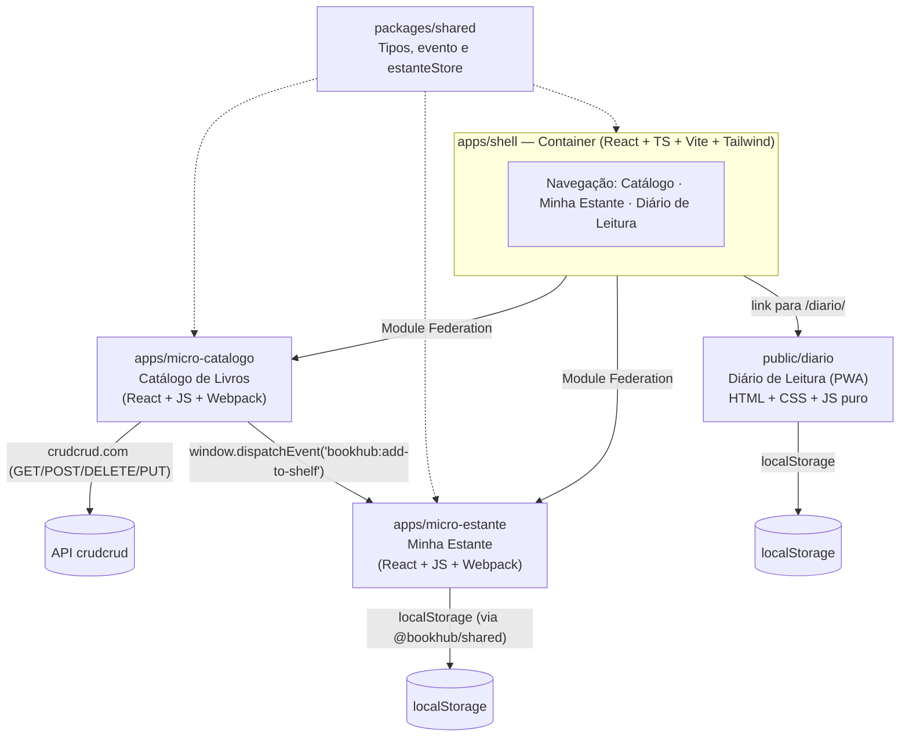

# 📚 BookHub — Plataforma de Leitura

Um único produto, um único repositório: o **BookHub** ajuda você a catalogar
livros, montar sua estante pessoal e registrar suas sessões de leitura.
Internamente ele é composto por um shell principal, dois micro frontends e
um PWA — mas para quem usa, é uma coisa só.

🔗 **Aplicação publicada:** preencha aqui após o primeiro deploy —
`https://SEU-PROJETO.vercel.app` _(veja [Deploy](#-cicd-e-deploy) abaixo)_

## Sumário

- [O que o BookHub faz](#-o-que-o-bookhub-faz)
- [Arquitetura](#-arquitetura)
- [Estrutura do repositório](#-estrutura-do-repositório)
- [Como rodar](#-como-rodar)
- [Configurando o crudcrud.com](#-configurando-o-crudcrudcom)
- [Comunicação entre os micros](#-comunicação-entre-os-micros)
- [Diário de Leitura (PWA)](#-diário-de-leitura-pwa)
- [CI/CD e Deploy](#-cicd-e-deploy)
- [Performance](#-performance)
- [Design system](#-design-system)

## 📖 O que o BookHub faz

- **Catálogo** — cadastra livros (título, autor, status de leitura),
  consumindo uma API real do crudcrud.com. Lista, adiciona, remove e
  alterna o status "Lido"/"Não lido".
- **Minha Estante** — os livros que você escolhe adicionar a partir do
  Catálogo aparecem aqui, na sua estante pessoal.
- **Diário de Leitura** — um PWA instalável e que funciona offline, para
  registrar sessões de leitura (livro, páginas lidas, data, anotações).

## 🏗️ Arquitetura



O **shell** é o Container: ele é a aplicação que o usuário abre, e carrega
os dois micro frontends em tempo de execução via **Webpack Module
Federation** (usando `@module-federation/vite` no lado do host Vite e
`@module-federation/enhanced` nos dois remotes Webpack). O **Diário de
Leitura** é um PWA independente, acessível em `/diario/`, sem depender de
build nenhum — é HTML/CSS/JS puro.

## 📂 Estrutura do repositório

```
bookhub/
├── apps/
│   ├── shell/            # Container: React + TS + Vite + Tailwind
│   ├── micro-catalogo/   # Micro Frontend: Catálogo (React + JS + Webpack MF)
│   └── micro-estante/    # Micro Frontend: Estante (React + JS + Webpack MF)
├── packages/
│   └── shared/           # Tipos, constantes e utilitários compartilhados
├── public/
│   └── diario/           # PWA "Diário de Leitura" (HTML/CSS/JS puro)
├── docs/
│   └── performance/       # Relatórios Lighthouse antes/depois
├── scripts/
│   └── copy-diario.mjs   # Copia public/diario para dentro do build do shell
├── .github/workflows/main.yml   # CI/CD
├── package.json          # Workspaces + scripts globais
└── vercel.json            # Config de build/deploy na Vercel
```

## 🚀 Como rodar

Pré-requisito: Node.js 18+.

```bash
npm install                # instala as dependências de todos os workspaces
cp apps/micro-catalogo/.env.example apps/micro-catalogo/.env
# edite apps/micro-catalogo/.env com sua própria URL do crudcrud.com
# (veja a seção "Configurando o crudcrud.com" abaixo)

npm run dev                 # sobe shell + micro-catalogo + micro-estante juntos
```

Acesse **http://localhost:3000**.

### Rodando cada parte isoladamente

```bash
npm run dev -w apps/micro-catalogo   # http://localhost:3001 (standalone)
npm run dev -w apps/micro-estante    # http://localhost:3002 (standalone)
npm run dev -w apps/shell            # http://localhost:3000 (shell sozinho)

npx serve public/diario              # PWA Diário de Leitura, isolada
```

### Scripts da raiz

| Script | O que faz |
|---|---|
| `npm run dev` | sobe shell + os dois micros em paralelo (via `concurrently`) |
| `npm run build` | builda os dois micros, depois o shell, e copia o Diário para dentro do build |
| `npm run lint` | roda o ESLint em shell, micro-catalogo e micro-estante |
| `npm run test` | roda a suíte de testes (Vitest) do shell |
| `npm run typecheck` | roda o `tsc --noEmit` do shell |

## 🔑 Configurando o crudcrud.com

O micro Catálogo (`apps/micro-catalogo`) precisa de um endpoint do
[crudcrud.com](https://crudcrud.com) — gratuito, sem login, mas **único por
sessão de navegador e válido por ~72 horas**.

1. Acesse **https://crudcrud.com** no navegador.
2. Copie a URL única exibida (ex: `https://crudcrud.com/api/1a2b3c4d.../livros`).
3. Configure:
   ```bash
   cd apps/micro-catalogo
   cp .env.example .env
   ```
   ```env
   CRUDCRUD_URL=https://crudcrud.com/api/SEU_ENDPOINT_AQUI/livros
   ```
4. Reinicie o `npm run dev`. Se o endpoint expirar, gere um novo e repita.

## 🔌 Comunicação entre os micros

O micro Catálogo e o micro Estante **não compartilham código de UI** — a
comunicação acontece por um evento global do navegador:

```js
// micro-catalogo: ao clicar em "Adicionar à estante"
window.dispatchEvent(new CustomEvent('bookhub:add-to-shelf', { detail: book }));
```

```js
// micro-estante: escuta o mesmo evento
window.addEventListener('bookhub:add-to-shelf', (event) => { /* ... */ });
```

O nome do evento (`ADD_TO_SHELF_EVENT`) vive em `packages/shared`, o único
código de fato compartilhado entre os dois micros.

**Detalhe importante:** como o shell só monta cada aba quando ela está
ativa (ver [Performance](#-performance)), o micro Estante pode não estar
montado no momento em que o evento é disparado. Por isso o **shell**
registra um listener persistente assim que a aplicação inicia
(`startShelfPersistence()`, em `packages/shared/src/estanteStore.ts`) que
grava a estante em `localStorage` independente de qual aba está aberta; o
micro Estante lê esse `localStorage` ao montar, garantindo que nenhum livro
adicionado se perca — e, como bônus, a estante sobrevive a um refresh da
página.

## 📔 Diário de Leitura (PWA)

Acessível em **`/diario/`** a partir do menu do shell. Registra sessões de
leitura (livro, páginas, data, anotações) em `localStorage`, funciona
offline via Service Worker, e pode ser instalado na tela inicial
(`beforeinstallprompt`). Detalhes completos, incluindo como testar como PWA
no Lighthouse, em [`public/diario`](public/diario) — veja `index.html`,
`manifest.json` e `service-worker.js`.

> Em produção, `npm run build` copia `public/diario` para dentro de
> `apps/shell/dist/diario`, então o PWA fica publicado no mesmo domínio,
> em `/diario/`.

## ⚙️ CI/CD e Deploy

Workflow único em [`.github/workflows/main.yml`](.github/workflows/main.yml),
rodando em push/PR para `main`:

```
Lint → Testes (Vitest) → Build (micros + shell) → Deploy (Vercel, só em push na main)
```

O deploy usa [`amondnet/vercel-action@v25`](https://github.com/amondnet/vercel-action)
e o [`vercel.json`](vercel.json) da raiz, que builda o monorepo inteiro
(`npm run build`) e publica `apps/shell/dist`.

### Secrets necessários (GitHub → Settings → Secrets and variables → Actions)

| Secret | Onde encontrar |
|---|---|
| `VERCEL_TOKEN` | [vercel.com/account/tokens](https://vercel.com/account/tokens) |
| `VERCEL_ORG_ID` | rode `npx vercel link` uma vez em `bookhub/` → `.vercel/project.json` |
| `VERCEL_PROJECT_ID` | mesmo arquivo `.vercel/project.json` |

> **Nota sobre os micros em produção:** o deploy publica o **shell**. Os
> micros Catálogo e Estante continuam sendo consumidos via
> `http://localhost:3001` / `:3002` (Module Federation) — ou seja, as abas
> Catálogo e Minha Estante funcionam plenamente quando você roda os micros
> localmente (`npm run dev -w apps/micro-catalogo`, etc.), e mostram uma
> mensagem de erro amigável em produção caso os micros não estejam
> publicados. Isso é intencional: reflete a natureza de um micro frontend
> de verdade, onde cada parte é implantada (e pode ser testada)
> separadamente — ver `RemoteErrorBoundary` no shell.

## 📈 Performance

Auditoria completa (Lighthouse, antes/depois, com prints) no próprio
BookHub: [`docs/performance/README.md`](docs/performance/README.md).
Resumo: nota de Performance **80 → 82**, First Contentful Paint e Speed
Index caindo de **2.9s → 2.5s**, após remover uma fonte bloqueante e
aplicar code splitting por aba (só carrega o micro da aba ativa).

## 🎨 Design system

- **Tailwind CSS v4** (tema customizado: paleta índigo/violeta + acento
  laranja para ações de destaque) aplicado nos três apps (shell,
  micro-catalogo, micro-estante) para um visual consistente.
- **Dark mode** com toggle manual (persistido em `localStorage`) e
  detecção automática de `prefers-color-scheme`.
- **Tipografia Inter**, ícones via **lucide-react** (importados
  individualmente, sem carregar a biblioteca inteira).
- Layout responsivo mobile-first, cantos arredondados, sombras suaves e
  estados vazios ilustrados ("Nenhum livro cadastrado ainda", "Sua estante
  está vazia").
